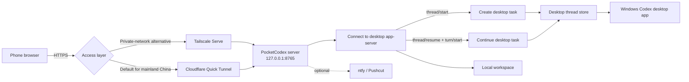

<div align="center">

# PocketCodex

**Connect to and continue Codex desktop tasks from a phone browser.**

[](https://github.com/wanlixing-dream/Pocket-Codex/actions/workflows/ci.yml)
[](./LICENSE)


**[中文](./README.md)** · **[Architecture](./docs/ARCHITECTURE.md)** · **[Notifications and approvals](./docs/NOTIFICATIONS.md)**

</div>

> [!IMPORTANT]
> PocketCodex is an unofficial, community-built project. It is not affiliated with or endorsed by OpenAI.
> It connects to the `app-server` bundled with the Windows Codex desktop app. It does not require a separate command-line package and is not a remote screen mirror.

## What it does

- Lists recent tasks from the Codex desktop app.
- Sends a new prompt to the same desktop thread.
- Creates a desktop task in an allowed project folder.
- Uploads JPEG, PNG, or WebP images for Codex to inspect.
- Shows run status, elapsed time, and output, and can stop an active run.
- Supports browser speech recognition for voice input.
- Optionally sends completion and approval notifications through ntfy or Pushcut.

Codex, its threads, and your project files remain on your desktop. The phone is only a remote client.

## How it works



See [Architecture](./docs/ARCHITECTURE.md) for component boundaries, request flows, and the security model.

## Requirements

### Desktop

- Windows 10/11. The current release integrates with the Microsoft Store Codex desktop app for Windows.
- Python 3.10 or newer.
- The **Windows Codex desktop app** installed from Microsoft Store and signed in.
- One remote access option:
  - Default setup: [cloudflared](https://developers.cloudflare.com/cloudflare-one/connections/connect-networks/downloads/)
  - Private-network alternative: [Tailscale](https://tailscale.com/download)

### Phone

- Safari, Chrome, or another modern browser.
- The phone must be able to reach the generated `trycloudflare.com` URL. Some mainland-China iPhone users use an already-installed proxy client such as Shadowrocket; PocketCodex does not provide a proxy service.
- Tailscale installed and signed in to the same tailnet only when using the alternative setup.

The Python server uses only the standard library. There is no `pip install` step.

## Quick start

### 1. Clone and verify

```powershell
git clone https://github.com/wanlixing-dream/Pocket-Codex.git
cd Pocket-Codex
python --version
```

Open the Codex desktop app, sign in, and confirm that it can create a local task. PocketCodex discovers the app's bundled app-server automatically; no `codex` command is required on `PATH`.

### 2. Start PocketCodex

```powershell
python .\remote_codex_server.py
```

The server listens only on `http://127.0.0.1:8765` by default. On first start it creates a private `remote.env` containing a random access token. Open the printed local URL on the desktop first and confirm that the desktop task list loads.

> [!WARNING]
> Never commit, screenshot, or publicly share `remote.env`. Anyone with its token may be able to send instructions to your Codex desktop threads.

### 3. Connect with Cloudflare Quick Tunnel (default)

Install `cloudflared`, keep PocketCodex running, and start a second PowerShell:

```powershell
cloudflared tunnel --url http://127.0.0.1:8765
```

Open the generated URL on the phone and append the token once:

```text
https://random-name.trycloudflare.com/#token=YOUR_REMOTE_CODEX_TOKEN
```

The web client stores the token in that browser and removes the fragment from the address bar. Quick Tunnel URLs are public and normally change after cloudflared restarts, so never share the complete URL in chats, issues, or screenshots.

### 4. Tailscale Serve (private-network alternative)

Tailscale adds device identity and tailnet ACLs. Use it when it is available and you prefer a stable private address:

```powershell
tailscale serve --bg http://127.0.0.1:8765
tailscale serve status
```

Open the reported HTTPS URL and append the token on first use:

```text
https://your-device.your-tailnet.ts.net/#token=YOUR_REMOTE_CODEX_TOKEN
```

Stop sharing with `tailscale serve reset`.

### 5. Use the mobile client

1. Select a Codex desktop thread from Recent Tasks.
2. Enter a prompt and optionally attach up to four images.
3. Send it to continue that thread through the desktop app's bundled app-server.
4. Use the `+` button to choose a folder and create a new desktop task.
5. Watch the run state, inspect output, or stop the process.

## Allowed project roots

The new-task folder picker only exposes `Desktop` and `Documents` by default. This is an explicit allowlist, not a refresh problem.

Complete one first start so PocketCodex generates a secure token, then add `REMOTE_CODEX_ROOTS` to `remote.env`. Separate Windows paths with semicolons:

```dotenv
REMOTE_CODEX_ROOTS=C:\Users\you\Desktop;C:\Users\you\source;D:\Projects
```

Restart PocketCodex after changing the setting. The allowlist controls where a new task may start; it is not a filesystem sandbox for Codex and does not restrict existing threads.

## Configuration

Start from [`remote.env.example`](./remote.env.example), or let PocketCodex create `remote.env` automatically:

```dotenv
# At least 24 characters. A long random value is recommended.
REMOTE_CODEX_TOKEN=replace-with-a-long-random-token

# Optional roots for new desktop tasks.
REMOTE_CODEX_ROOTS=C:\Users\you\Desktop;D:\Projects
```

The real `remote.env` is excluded by `.gitignore`.

## Optional notifications and approvals

The hook scripts are optional and are not required for mobile desktop-task control:

- `watch_done.py` sends completion, failure, and usage-limit notifications.
- `watch_approve.py` forwards supported interactive Codex or Claude Code approvals to a phone or watch.
- ntfy supports phone and Wear OS notifications.
- Pushcut can provide richer iPhone and Apple Watch actions.

PocketCodex uses its own app-server connection. Interactive approval requests are not automatically transferred to another open desktop window; the current remote endpoint rejects unsupported requests instead of approving them. See [Notifications and approvals](./docs/NOTIFICATIONS.md).

## Security

PocketCodex can start Codex on your machine and should be treated as a remote administration endpoint:

- Keep the server bound to `127.0.0.1`; do not expose `0.0.0.0` directly.
- The default Quick Tunnel is a public endpoint. Treat the complete tokenized URL as a password.
- When Tailscale is available, its device identity and ACLs provide an additional private-network layer.
- Do not share URLs containing `#token=` or `?token=`.
- Rotate the token and reset the tunnel if a URL or token may have leaked.
- Allow only project roots that you genuinely need remotely.
- `REMOTE_CODEX_ROOTS` limits the new-task picker only. Codex permissions are still governed by its sandbox, approval policy, and the desktop user account.
- A valid client can read recent prompt/response metadata and send new instructions.
- Stop cloudflared and PocketCodex when they are not in use; Quick Tunnel is not a private network.

## Current limitations

- PocketCodex shares persistent threads with the desktop app, but it is not a live screen mirror. Do not submit to the same thread from phone and desktop at the same time.
- The desktop `app-server` is an internal interface and may require compatibility updates after a Codex desktop release.
- Only one PocketCodex run may be active for a given thread.
- The server lists the 30 most recent desktop threads by default.
- Prompts are limited to 20,000 characters.
- Each request accepts up to four JPEG/PNG/WebP images, 8 MB each.
- Runs time out after six hours and retain the final 30,000 output characters in memory.
- A folder level shows at most 250 non-hidden subdirectories.
- Run state is in memory and is lost when the service restarts.
- `start_remote_codex.ps1` currently targets a specific Windows + cloudflared + ntfy setup; use the manual commands above for a portable installation.

## Project layout

```text
Pocket-Codex/
├── remote_codex_server.py   # API, authentication, desktop discovery, app-server client
├── remote_web/              # Mobile HTML/CSS/JavaScript client
├── start_remote_codex.ps1   # Windows Quick Tunnel helper
├── watch_approve.py         # Optional approval hook
├── watch_done.py            # Optional completion/failure hook
├── examples/                # Codex and Claude Code hook examples
├── docs/                    # Architecture and optional feature guides
└── tests/                   # Standard-library unittest suite
```

## Development

```powershell
python -m unittest discover -s tests -v
python -m py_compile remote_codex_server.py watch_approve.py watch_done.py
```

Core unit tests run without network access; desktop discovery and end-to-end app-server verification are Windows-specific.

## Troubleshooting

| Symptom | Check |
| --- | --- |
| The phone shows `Unauthorized` | Reopen a URL with the current `#token=`; after rotation, clear this site's browser storage |
| Projects outside Desktop/Documents are missing | Add `REMOTE_CODEX_ROOTS` to the generated `remote.env`, then restart the server |
| The task list is empty | Complete at least one task in the Codex desktop app under the same Windows account |
| The phone cannot connect | Verify that the Python server is running, then inspect `tailscale serve status` or the cloudflared console |
| Codex desktop cannot be found | Install and launch Codex from Microsoft Store, or set `REMOTE_CODEX_DESKTOP_EXE` to its bundled `codex.exe` |
| A remote run needs approval | Return to the Codex desktop app; PocketCodex never auto-approves unsupported sensitive actions |

Contributions are welcome. Changes involving authentication, filesystem access, or command execution should document their threat model and verification evidence.

## License

[MIT](./LICENSE)
