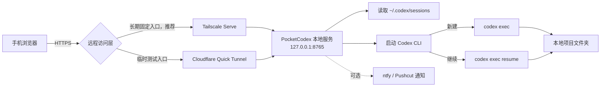

<div align="center">

# PocketCodex

**在手机浏览器里连接并控制桌面电脑上的 Codex CLI session。**

[](https://github.com/wanlixing-dream/Pocket-Codex/actions/workflows/ci.yml)
[](./LICENSE)


**[English](./README.en.md)** · **[架构说明](./docs/ARCHITECTURE.md)** · **[通知与审批](./docs/NOTIFICATIONS.md)**

</div>

> [!IMPORTANT]
> PocketCodex 是社区维护的非官方项目，与 OpenAI 没有隶属或背书关系。
> 它通过 Codex CLI 的 `exec` / `exec resume` 命令工作，不会直接遥控 Codex 桌面图形界面。

## PocketCodex 能做什么

- 在手机上查看桌面电脑最近的 Codex session。
- 选择已有 session，发送下一条文字指令。
- 在指定项目文件夹中新建 Codex session。
- 从手机上传 JPEG、PNG 或 WebP 图片给 Codex 分析。
- 查看执行状态、耗时与输出，并可停止当前任务。
- 使用手机浏览器的语音识别输入指令。
- 可选接入 ntfy / Pushcut，在手机或手表接收完成通知和审批请求。

手机端不直接运行 Codex。所有 session、项目文件和 Codex 进程都留在你的桌面电脑上。

## 工作原理



详细的组件职责、请求流程和安全边界见 [架构说明](./docs/ARCHITECTURE.md)。

## 系统要求

### 桌面电脑

- Windows 10/11。核心 Python 服务也可运行于 macOS/Linux，但自动启动脚本目前面向 Windows。
- Python 3.10 或更高版本。
- 已安装并登录的 [Codex CLI](https://developers.openai.com/codex/cli)。
- 至少已有一个 Codex session，或者准备一个用于新建 session 的项目文件夹。
- 以下远程访问工具任选一个：
  - 长期固定入口，推荐：[Tailscale](https://tailscale.com/download)
  - 临时测试入口：[cloudflared](https://developers.cloudflare.com/cloudflare-one/connections/connect-networks/downloads/)

### 手机

- Safari、Chrome 或其他现代浏览器。
- 使用 Tailscale 时，手机也需要安装 Tailscale、登录与电脑相同的账号并保持已连接。
- 使用 Cloudflare Quick Tunnel 临时方案时，手机需要能够访问生成的 `trycloudflare.com` 地址。部分国内 iPhone 用户会使用已经安装的小火箭（Shadowrocket）等代理工具；PocketCodex 本身不提供代理服务。

PocketCodex 的 Python 服务只使用标准库，不需要运行 `pip install`。

## 五分钟开始使用

### 1. 获取项目

```powershell
git clone https://github.com/wanlixing-dream/Pocket-Codex.git
cd Pocket-Codex
```

### 2. 检查本地环境

```powershell
python --version
codex --version
```

确保 `codex` 已登录，并且在桌面电脑上可以正常启动任务。

### 3. 启动 PocketCodex

```powershell
python .\remote_codex_server.py
```

服务默认只监听：

```text
http://127.0.0.1:8765
```

首次启动会在项目目录生成私有配置 `remote.env`，其中包含随机访问令牌。终端会打印一条带令牌的本地地址，先在电脑浏览器打开它，确认可以看到 session 列表。

> [!WARNING]
> 不要提交、截图或公开分享 `remote.env`。任何拿到令牌的人都可能通过 PocketCodex 向你的本地 Codex session 发送指令。

### 4. 让手机连接电脑

长期使用推荐 Tailscale Serve。它给这台电脑分配固定的 tailnet HTTPS 主机名，电脑休眠、切换网络或 Tailscale 暂时断线后，恢复连接仍使用原地址，不需要不断打开新的 ntfy 链接。

#### 方案 A：Tailscale Serve（长期固定入口，推荐）

1. 在电脑和手机安装 Tailscale，登录同一账号并保持连接。
2. 在项目目录运行以下命令：

```powershell
.\start_remote_codex.ps1 -InstallWatchdog -AccessMode Tailscale
```

脚本会启动 PocketCodex、配置 Tailscale Serve、验证固定首页和带令牌 API，然后安装每 5 分钟巡检一次的当前用户计划任务 `RemoteCodexWatchdog`。验证成功后，旧 Cloudflare Quick Tunnel 会停止；配置了 ntfy 时，手机会收到一次 `Codex Remote - FIXED LINK` 通知。

固定地址形式如下：

```text
https://你的设备名.你的-tailnet.ts.net/#token=你的_REMOTE_CODEX_TOKEN
```

完整的私有链接同时保存在 `%LOCALAPPDATA%\RemoteCodex\remote-url.txt`，文件 ACL 仅允许当前 Windows 用户访问。首次从带令牌链接打开后，页面会保存令牌并从地址栏移除 fragment，以后继续使用同一个书签即可。

查看当前模式、服务健康状态和 Tailscale Serve 状态：

```powershell
.\start_remote_codex.ps1 -Status
```

`RemoteCodexWatchdog` 是 Windows 任务计划程序中的用户级任务，作用对应 macOS 的 LaunchAgent：Windows 不能运行 `launchctl` 或 LaunchAgent plist。当前任务每 5 分钟恢复 PocketCodex；Tailscale 自己的 Windows 服务负责保持固定 Serve 配置。

停用自动恢复时先删除计划任务，再重置 Serve：

```powershell
.\start_remote_codex.ps1 -RemoveWatchdog
tailscale serve reset
```

#### 方案 B：Cloudflare Quick Tunnel（临时测试）

Quick Tunnel 不要求手机安装 Tailscale，但地址是随机临时域名，不适合作为长期书签。安装 `cloudflared` 后执行：

```powershell
.\start_remote_codex.ps1 -AccessMode Cloudflare
```

需要计划任务自动重建临时通道时执行：

```powershell
.\start_remote_codex.ps1 -InstallWatchdog -AccessMode Cloudflare
```

地址变化时，配置好的 ntfy topic 会收到 `Codex Remote - NEW LINK`。Quick Tunnel 可从公网访问，完整 tokenized URL 必须视为密码。

### 5. 从手机开始工作

1. 从“最近任务”选择一个现有 session。
2. 输入下一条指令，也可以附加最多 4 张图片。
3. 点击发送，桌面电脑会运行 `codex exec resume`。
4. 点击右上角的 `+`，选择项目目录并输入第一条指令，可新建 session。
5. 任务运行期间可以查看状态或点击停止。

## 配置可选项目目录

新建 session 时，文件夹选择器默认只允许访问当前用户的 `Desktop` 和 `Documents`。这是目录白名单，不是文件夹没有刷新。

如需显示其他项目目录，先完成一次首次启动，让服务生成安全令牌；然后在 `remote.env` 增加 `REMOTE_CODEX_ROOTS`。Windows 使用分号分隔多个目录：

```dotenv
REMOTE_CODEX_ROOTS=C:\Users\你的用户名\Desktop;C:\Users\你的用户名\source;D:\Projects
```

macOS/Linux 使用冒号分隔：

```dotenv
REMOTE_CODEX_ROOTS=/Users/you/Desktop:/Users/you/Projects
```

修改后需要重启 PocketCodex 服务。服务只允许浏览和选择这些根目录及其子目录；普通文件、隐藏目录以及白名单外路径不会出现在选择器中。该白名单只约束新建 session 的起始目录，不限制已有 session，也不是 Codex 的文件系统沙箱。

## 配置文件

`remote.env` 由服务首次启动时自动创建，也可以手动填写：

```dotenv
# 至少 24 个字符；建议使用随机生成的长令牌
REMOTE_CODEX_TOKEN=replace-with-a-long-random-token

# 可选：允许新建 session 的项目根目录
REMOTE_CODEX_ROOTS=C:\Users\you\Desktop;D:\Projects
```

可以从 [`remote.env.example`](./remote.env.example) 开始配置。真实的 `remote.env` 已被 `.gitignore` 排除。

## 可选：手机/手表通知与审批

`watch_done.py` 和 `watch_approve.py` 是可选增强，不影响 PocketCodex 的核心远程控制功能：

- `watch_done.py`：任务完成、失败或额度接近上限时发送通知。
- `watch_approve.py`：通过 Codex/Claude Code hook 把支持的审批请求发送到手机或手表。
- ntfy 可直接用于 Android、Wear OS 和手机通知。
- Pushcut 可为 iPhone / Apple Watch 提供更完整的交互通知。

完整配置步骤见 [通知与审批](./docs/NOTIFICATIONS.md)。

## 安全说明

PocketCodex 可以在你的电脑上启动 Codex 并访问允许的项目目录，应把它视为远程管理入口：

- 服务默认绑定 `127.0.0.1`；不要直接改成 `0.0.0.0` 暴露到局域网或公网。
- 默认 Quick Tunnel 是公网入口；令牌等同密码，完整访问链接只能自己保存。
- 能够使用 Tailscale 时，可用其设备身份和 ACL 增加一层私有网络隔离。
- 不要公开分享带 `#token=` 或 `?token=` 的链接。
- 如果链接或令牌可能泄漏，停止服务，删除 `remote.env` 后重新启动以生成新令牌。
- 仅把 `REMOTE_CODEX_ROOTS` 指向确实需要远程工作的目录。
- `REMOTE_CODEX_ROOTS` 只限制新建 session 的文件夹选择器，不能限制已有 session 或 Codex 后续能够访问的路径。
- PocketCodex 只允许继续本机记录中存在的 session，但发送给 Codex 的指令仍可能修改项目文件或运行命令。
- 远程任务使用非交互 `codex exec`；不能依赖交互式 `PermissionRequest` hook 为远程任务兜底。
- Cloudflare Quick Tunnel 不建议在无人看管时长期运行；不用时应先删除 `RemoteCodexWatchdog`，再停止 cloudflared 和 PocketCodex 服务。

更多威胁边界见 [架构说明：安全边界](./docs/ARCHITECTURE.md#安全边界)。

## 当前限制

- 远程执行使用 Codex CLI 的非交互 `exec` 模式，不等同于桌面端/TUI 的实时画面镜像。
- 服务运行期间同一个 session 只能有一个 PocketCodex 任务执行。
- session 列表来自 `~/.codex/sessions`，默认最多读取最近 30 个。
- 每条消息最多上传 4 张图片，每张不超过 8 MB。
- 单次运行最长 6 小时，页面保留该次运行输出的最后 30,000 个字符。
- 文件夹选择器只显示目录，单层最多显示 250 个非隐藏子目录。
- 图片会在任务正常收尾时删除；服务进程异常退出时可能遗留在 `.remote_uploads/`。
- 停止任务只会终止进程，不会回滚 Codex 已完成的文件修改。
- `RemoteCodexWatchdog` 每 5 分钟巡检一次；与使用 `KeepAlive` 的 macOS LaunchAgent 相比，异常退出后的恢复最多会延迟约 5 分钟。

## 常见问题

| 现象 | 检查方法 |
| --- | --- |
| 手机显示 `Unauthorized` | 从包含正确 `#token=` 的地址重新打开；令牌轮换后清除该站点的浏览器存储 |
| 看不到桌面/文档之外的项目 | 在首次启动生成的 `remote.env` 中配置 `REMOTE_CODEX_ROOTS`，然后重启服务 |
| session 列表为空 | 先在桌面 Codex CLI 中完成至少一个 session，并确认 `~/.codex/sessions` 存在 |
| 手机无法连接 | 确认 Python 服务仍在运行，再检查 `tailscale serve status` 或 cloudflared 终端 |
| `codex` 找不到 | 确认 Codex CLI 已安装、登录并加入当前用户的 `PATH` |
| 远程任务遇到权限问题 | 回到桌面检查 Codex sandbox/approval 配置；非交互 `exec` 不等同于 TUI 审批流程 |

## 项目结构

```text
Pocket-Codex/
├── remote_codex_server.py   # HTTP API、认证、session 读取和 Codex 进程管理
├── remote_web/              # 手机端 HTML/CSS/JavaScript
├── start_remote_codex.ps1   # Windows Tailscale/Cloudflare 启动器与巡检任务
├── watch_approve.py         # 可选：远程审批 hook
├── watch_done.py            # 可选：完成/失败通知 hook
├── examples/                # Codex 与 Claude Code hook 配置示例
├── docs/                    # 架构和可选功能文档
└── tests/                   # 标准库 unittest 测试
```

## 开发与测试

```powershell
python -m unittest discover -s tests -v
python -m py_compile remote_codex_server.py watch_approve.py watch_done.py
```

测试不需要网络，GitHub Actions 会在 Windows、macOS 和 Linux 上运行。

## 开源路线

接下来适合优先完善：

- 统一的跨平台启动与配置向导。
- 可选择的 session 数量和项目根目录管理界面。
- 更完善的运行日志、清理策略和错误诊断。
- Tailscale/Cloudflare 状态检查与一键连接。
- 对移动端交互和安全边界的端到端测试。

欢迎提交 Issue 和 Pull Request。涉及认证、目录访问或命令执行的改动，请同时说明威胁模型与验证方式。

## License

[MIT](./LICENSE)
