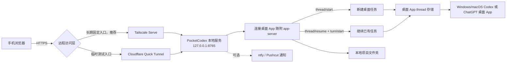

<div align="center">

# PocketCodex

**在手机浏览器里连接并继续桌面版 Codex 的任务。**

[](https://github.com/wanlixing-dream/Pocket-Codex/actions/workflows/ci.yml)
[](./LICENSE)


**[English](./README.en.md)** · **[架构说明](./docs/ARCHITECTURE.md)** · **[通知与审批](./docs/NOTIFICATIONS.md)**

</div>

> [!IMPORTANT]
> PocketCodex 是社区维护的非官方项目，与 OpenAI 没有隶属或背书关系。
> 它连接 Codex/ChatGPT 桌面 App 随附的 `app-server`，不要求另外安装命令行版本，也不是桌面画面的远程屏幕镜像。

## PocketCodex 能做什么

- 在手机上查看桌面版 Codex 最近的任务。
- 选择已有任务，向同一个 thread 发送下一条文字指令。
- 在指定项目文件夹中新建桌面版 Codex 任务。
- 从手机上传 JPEG、PNG 或 WebP 图片给 Codex 分析。
- 查看执行状态、耗时与输出，并可停止当前任务。
- 使用手机浏览器的语音识别输入指令。
- 可选接入 ntfy / Pushcut，在手机或手表接收完成通知和审批请求。

手机端不直接运行 Codex。所有 thread、项目文件和推理执行都留在你的桌面电脑上。

## 工作原理



详细的组件职责、请求流程和安全边界见 [架构说明](./docs/ARCHITECTURE.md)。

## 系统要求

### 桌面电脑

- Windows 10/11，已安装并登录 Microsoft Store 版 **Codex 桌面 App**；或 macOS，已安装并登录 **ChatGPT/Codex 桌面 App**。
- Python 3.10 或更高版本。
- 至少已有一个桌面版 Codex 任务，或者准备一个用于新建任务的项目文件夹。
- 以下远程访问工具任选一个：
  - 长期固定入口，推荐：[Tailscale](https://tailscale.com/download)
  - 临时测试入口：[cloudflared](https://developers.cloudflare.com/cloudflare-one/connections/connect-networks/downloads/)

### 手机

- Safari、Chrome 或其他现代浏览器。
- 使用 Tailscale Serve 时，手机也需要安装 Tailscale、登录与电脑相同的账号并保持已连接。
- 使用 Cloudflare Quick Tunnel 临时方案时，手机需要能够访问生成的 `trycloudflare.com` 地址。部分国内 iPhone 用户会使用已经安装的小火箭（Shadowrocket）等代理工具；PocketCodex 本身不提供代理服务。

PocketCodex 的 Python 服务只使用标准库，不需要运行 `pip install`。

## 五分钟开始使用

### 1. 获取项目

Windows PowerShell：

```powershell
git clone https://github.com/wanlixing-dream/Pocket-Codex.git
cd Pocket-Codex
python --version
```

macOS Terminal：

```bash
git clone https://github.com/wanlixing-dream/Pocket-Codex.git
cd Pocket-Codex
python3 --version
```

先打开桌面 App，完成登录，并确认它能在本机正常创建任务。PocketCodex 会自动发现桌面 App 随附的 app-server：Windows 通常来自 Microsoft Store 的 Codex App，macOS 通常来自 `/Applications/ChatGPT.app/Contents/Resources/codex` 或 `/Applications/Codex.app/Contents/Resources/codex`。

### 2. 启动 PocketCodex

Windows PowerShell：

```powershell
python .\remote_codex_server.py
```

macOS Terminal：

```bash
python3 remote_codex_server.py
```

服务默认只监听：

```text
http://127.0.0.1:8765
```

首次启动会在项目目录生成私有配置 `remote.env`，其中包含随机访问令牌；macOS/Linux 会自动把文件权限收紧为仅当前用户可读写。终端会打印一条带令牌的本地地址，先在电脑浏览器打开它，确认可以看到桌面任务列表。

> [!WARNING]
> 不要提交、截图或公开分享 `remote.env`。任何拿到令牌的人都可能通过 PocketCodex 向你的桌面版 Codex thread 发送指令。

### 3. 让手机连接电脑

长期使用推荐 Tailscale Serve。它给每台电脑分配固定的 tailnet HTTPS 主机名，电脑休眠、切换网络或 Tailscale 暂时断线后，恢复连接仍使用原地址，不需要不断打开新的 ntfy 链接。

#### 方案 A：Tailscale Serve（长期固定入口，推荐）

1. 在电脑和手机安装 [Tailscale](https://tailscale.com/download)，并登录同一账号。
2. 确认手机和电脑都在 Tailscale 设备列表中显示在线。
3. macOS 用户克隆仓库后可以直接在项目目录运行以下脚本，不必先手动启动 `remote_codex_server.py`。如果已经在终端手动启动，请先按 `Ctrl+C` 停止它：

```bash
python3 setup_tailscale_serve.py
```

首次使用时，Tailscale 可能打开浏览器要求授权 Serve。脚本随后会：

- 检查 `8765` 端口是否由 PocketCodex 的受管后台任务占用；发现手动进程时会拒绝迁移，避免后台任务反复启动失败；
- 把 `http://127.0.0.1:8765` 配置为后台 Tailscale Serve；
- 安装用户级 `com.pocketcodex.server` LaunchAgent；
- 在 Mac 登录后自动启动 PocketCodex，异常退出时自动恢复；
- 如果新 LaunchAgent 启动失败，尝试恢复旧的临时后台服务并保留原始错误；
- 验证固定首页和带令牌的 sessions API；
- 配置 ntfy 时，只发送一次经过验证的固定入口。

固定地址形式如下：

```text
https://你的设备名.你的-tailnet.ts.net/#token=你的_REMOTE_CODEX_TOKEN
```

首次从带令牌链接打开后，页面会把令牌保存在当前浏览器，并从地址栏移除 fragment。以后使用同一个书签或主屏幕图标即可。Mac 暂时离线时页面会打不开，但 Mac 与 Tailscale 恢复后刷新原地址即可，不会换域名。

Windows 可以先启动 PocketCodex，再手动配置固定入口：

```powershell
python .\remote_codex_server.py
tailscale serve --bg http://127.0.0.1:8765
tailscale serve status
```

macOS 卸载 PocketCodex 自动启动并关闭该 Serve 入口：

```bash
python3 setup_tailscale_serve.py --uninstall
```

#### 方案 B：Cloudflare Quick Tunnel（临时测试）

Quick Tunnel 不要求手机安装 Tailscale，但 Cloudflare 官方将它定位为测试/开发工具：地址是随机临时域名，没有 SLA，也不适合作为长期书签。如果当前网络无法访问生成的地址，请使用你已有且符合当地规定的网络环境。

1. 在电脑安装 `cloudflared`。macOS 可用 `brew install cloudflared`；Windows 可从 Cloudflare 官方下载页安装。
2. 保持 PocketCodex 服务运行，另开一个终端。
3. 执行：

```powershell
cloudflared tunnel --url http://127.0.0.1:8765
```

macOS 同样执行：

```bash
cloudflared tunnel --url http://127.0.0.1:8765
```

4. cloudflared 会显示一个临时 `https://*.trycloudflare.com` 地址。
5. 在该地址末尾添加首次启动时生成的令牌：

```text
https://随机地址.trycloudflare.com/#token=你的_REMOTE_CODEX_TOKEN
```

6. 用手机打开该地址。页面会把令牌保存在当前浏览器中，并从地址栏移除令牌片段。

也可以用跨平台辅助脚本一次启动 PocketCodex 和 Quick Tunnel：

Windows PowerShell：

```powershell
python .\start_remote_codex.py
```

macOS Terminal：

```bash
python3 start_remote_codex.py
```

脚本会等待服务和隧道可用，然后打印手机要打开的完整私有链接，并保持在前台运行。关闭该终端或按 `Ctrl+C` 会停止本次启动的服务和隧道。

如果希望 Quick Tunnel 地址变化后自动在手机收到新链接：

1. 在手机 ntfy app 中订阅一个足够长、不可猜测的 topic。
2. 将 `watch.env.example` 复制为不会提交的 `watch.env`。
3. 至少填写：

```dotenv
WATCH_TRANSPORT=ntfy
NTFY_NOTIFY_TOPIC=your-long-random-topic
NTFY_BASE=https://ntfy.sh
```

4. 运行 `python3 start_remote_codex.py`（Windows 使用 `python .\start_remote_codex.py`）。

辅助脚本会先等待带令牌的公网 API 连续通过检查，再发送一条可点击的 ntfy 通知；相同链接不会重复推送。ntfy 暂时不可用时只记录警告，不会关闭 PocketCodex 或隧道。完整配置见 [通知与审批](./docs/NOTIFICATIONS.md)。

Quick Tunnel 地址通常会在 cloudflared 重启后改变。该地址可从公网访问，访问令牌是主要的应用层防线，不要把完整链接发到群聊、Issue 或截图中。

如果手机刷新后看到 Cloudflare `Error 1016 Origin DNS error`，通常不是 PocketCodex 前端坏了，而是旧的 `*.trycloudflare.com` 临时域名已经失效，或电脑上的 cloudflared 已停止。重新运行上面的脚本或 `cloudflared tunnel --url http://127.0.0.1:8765`，用新生成的地址打开即可。

### 4. 从手机开始工作

1. 从“最近任务”选择一个桌面版 Codex thread。
2. 输入下一条指令，也可以附加最多 4 张图片。
3. 点击发送，PocketCodex 会通过桌面 App 随附的 app-server 继续同一个 thread。
4. 点击右上角的 `+`，选择项目目录并输入第一条指令，可新建桌面版任务。
5. 任务运行期间可以查看状态或点击停止。


## 一部手机连接多台电脑

可以实现，但当前是“每台电脑一个入口”，不是一个集中式设备面板：

- 每台 Windows 或 macOS 电脑都运行自己的 `remote_codex_server.py`。
- 推荐把每台电脑加入同一个 tailnet，并使用各自固定的 Tailscale 设备主机名。
- 手机浏览器把这些地址分别加入书签或添加到主屏幕，例如“家里的 Mac mini”“办公室 Windows”。
- 每个入口都有独立的 `remote.env` 令牌；不要把多台电脑共用同一个 token。
- 同一台手机可以保存多个入口，但一次页面只能控制当前打开的那台电脑。

如果后续要做成一个真正的“多电脑列表”，建议增加设备注册/命名、令牌轮换、在线状态检查和撤销机制；不要把多个电脑直接挂在同一个公网入口后面混用。

## 配置可选项目目录

新建桌面任务时，文件夹选择器默认只允许访问当前用户的 `Desktop` 和 `Documents`。这是目录白名单，不是文件夹没有刷新。

如需显示其他项目目录，先完成一次首次启动，让服务生成安全令牌；然后在 `remote.env` 增加 `REMOTE_CODEX_ROOTS`。Windows 使用分号分隔多个目录，macOS/Linux 使用冒号分隔多个目录：

```dotenv
# Windows
REMOTE_CODEX_ROOTS=C:\Users\你的用户名\Desktop;C:\Users\你的用户名\source;D:\Projects

# macOS / Linux
REMOTE_CODEX_ROOTS=/Users/you/Desktop:/Users/you/Projects
```

修改后需要重启 PocketCodex 服务。服务只允许浏览和选择这些根目录及其子目录；普通文件、隐藏目录以及白名单外路径不会出现在选择器中。该白名单只约束新建任务的起始目录，不限制已有 thread，也不是 Codex 的文件系统沙箱。

## 配置文件

`remote.env` 由服务首次启动时自动创建，也可以手动填写：

```dotenv
# 至少 24 个字符；建议使用随机生成的长令牌
REMOTE_CODEX_TOKEN=replace-with-a-long-random-token

# 可选：允许新建桌面任务的项目根目录
# Windows 用分号；macOS/Linux 用冒号
REMOTE_CODEX_ROOTS=C:\Users\you\Desktop;D:\Projects
# REMOTE_CODEX_ROOTS=/Users/you/Desktop:/Users/you/Projects
```

可以从 [`remote.env.example`](./remote.env.example) 开始配置。真实的 `remote.env` 已被 `.gitignore` 排除；辅助脚本读取 `remote.env` 和 `watch.env` 时，也会在 macOS/Linux 上自动将权限收紧为 `600`。

## 可选：手机/手表通知与审批

`watch_done.py` 和 `watch_approve.py` 是可选增强，不影响 PocketCodex 的核心远程控制功能：

- `watch_done.py`：任务完成、失败或额度接近上限时发送通知。
- `watch_approve.py`：通过 Codex/Claude Code hook 把支持的审批请求发送到手机或手表。
- 核心手机远程控制不依赖 ntfy 或 Pushcut。
- ntfy 可用于 Android、Wear OS、普通手机通知；Tailscale Serve 只在首次配置或固定主机名/token 变化时发送入口，Quick Tunnel 每次随机地址变化时仍可发送新链接。
- Pushcut 可为 iPhone / Apple Watch 提供更完整的交互通知；动态按钮等高级能力可能需要 Pushcut Pro。

完整配置步骤见 [通知与审批](./docs/NOTIFICATIONS.md)。

## 安全说明

PocketCodex 可以在你的电脑上启动 Codex 并访问允许的项目目录，应把它视为远程管理入口：

- 服务默认绑定 `127.0.0.1`；不要直接改成 `0.0.0.0` 暴露到局域网或公网。
- 推荐的 Tailscale Serve 只在 tailnet 内可达，设备身份和 ACL 是令牌以外的第二层访问控制。
- Quick Tunnel 是公网临时入口；令牌等同密码，完整访问链接只能自己保存。
- 不要公开分享带 `#token=` 或 `?token=` 的链接。
- 如果链接或令牌可能泄漏，停止服务，删除 `remote.env` 后重新启动以生成新令牌。
- 仅把 `REMOTE_CODEX_ROOTS` 指向确实需要远程工作的目录。
- `REMOTE_CODEX_ROOTS` 只限制新建任务的文件夹选择器，不能限制已有 thread 或 Codex 后续能够访问的路径。
- PocketCodex 只允许继续桌面 App 本地记录中存在的 thread，但发送给 Codex 的指令仍可能修改项目文件或运行命令。
- PocketCodex 使用独立的 app-server 连接。需要人工审批的请求不会自动出现在另一个已打开的桌面窗口中；当前版本会拒绝未支持的交互请求并提示回到电脑处理。
- Cloudflare Quick Tunnel 不建议在无人看管时长期运行；不用时应停止 cloudflared 和 PocketCodex 服务。

更多威胁边界见 [架构说明：安全边界](./docs/ARCHITECTURE.md#安全边界)。

## 当前限制

- PocketCodex 与桌面窗口共享持久化 thread，但不是桌面画面的实时镜像。不要同时从手机和桌面窗口向同一个 thread 发送任务。
- 桌面 App 的 `app-server` 是内部接口，Codex 更新后可能需要同步更新 PocketCodex 的兼容层。
- 服务运行期间同一个 thread 只能有一个 PocketCodex 任务执行。
- 任务列表来自桌面 App 的 `thread/list`，默认最多读取最近 30 个。
- 每条消息最多上传 4 张图片，每张不超过 8 MB。
- 单次运行最长 6 小时，页面保留该次运行输出的最后 30,000 个字符。
- 文件夹选择器只显示目录，单层最多显示 250 个非隐藏子目录。
- 图片会在任务正常收尾时删除；服务进程异常退出时可能遗留在 `.remote_uploads/`。
- 停止任务只会终止进程，不会回滚 Codex 已完成的文件修改。
- `setup_tailscale_serve.py` 当前自动安装 LaunchAgent 的部分仅支持 macOS；Windows 先使用手动 Serve 命令。
- `start_remote_codex.ps1` 是面向 Windows + cloudflared + ntfy 临时入口的便捷脚本。

## 常见问题

| 现象 | 检查方法 |
| --- | --- |
| 手机显示 `Unauthorized` | 从包含正确 `#token=` 的地址重新打开；令牌轮换后清除该站点的浏览器存储 |
| 看不到桌面/文档之外的项目 | 在首次启动生成的 `remote.env` 中配置 `REMOTE_CODEX_ROOTS`，然后重启服务 |
| 任务列表为空 | 先在 Codex/ChatGPT 桌面 App 中完成至少一个任务，并确认服务运行在同一个系统用户下 |
| Tailscale 固定地址打不开 | 确认手机和电脑 Tailscale 均在线，再检查 `tailscale serve status` 与 `launchctl print gui/$(id -u)/com.pocketcodex.server` |
| Quick Tunnel 地址打不开 | 临时域名可能已失效；重新运行 `start_remote_codex.py` 并使用最新 ntfy 链接 |
| 没收到 Tailscale 固定链接 | 相同固定链接不会重复推送；直接使用原书签，并检查运行目录中的 `notify-error.log` |
| 找不到桌面版 app-server | Windows 从 Microsoft Store 安装并启动 Codex；macOS 安装并启动 ChatGPT/Codex；也可通过 `REMOTE_CODEX_DESKTOP_EXE` 指定随附的 `codex`/`codex.exe` |
| 远程任务遇到审批或权限问题 | 回到 Codex 桌面 App 处理；当前远程端不会自动批准敏感操作 |

## 项目结构

```text
Pocket-Codex/
├── remote_codex_server.py   # HTTP API、认证、桌面 App 发现与 app-server 连接
├── setup_tailscale_serve.py # macOS 固定入口与 LaunchAgent 配置
├── remote_web/              # 手机端 HTML/CSS/JavaScript
├── start_remote_codex.ps1   # Windows 自动启动与 Quick Tunnel 辅助脚本
├── watch_approve.py         # 可选：远程审批 hook
├── watch_done.py            # 可选：完成/失败通知 hook
├── examples/                # Codex 与 Claude Code hook 配置示例
├── docs/                    # 架构和可选功能文档
└── tests/                   # 标准库 unittest 测试
```

## 开发与测试

```powershell
python -m unittest discover -s tests -v
python -m py_compile remote_codex_server.py setup_tailscale_serve.py watch_approve.py watch_done.py
```

核心单元测试不需要网络；桌面 App 发现覆盖 Windows 和 macOS，端到端连接需要在对应桌面系统上实测。

## 开源路线

接下来适合优先完善：

- 统一的跨平台启动与配置向导。
- 可选择的 thread 数量和项目根目录管理界面。
- 更完善的运行日志、清理策略和错误诊断。
- Windows Tailscale Serve 自动启动与服务安装。
- 对移动端交互和安全边界的端到端测试。

欢迎提交 Issue 和 Pull Request。涉及认证、目录访问或命令执行的改动，请同时说明威胁模型与验证方式。

## License

[MIT](./LICENSE)
