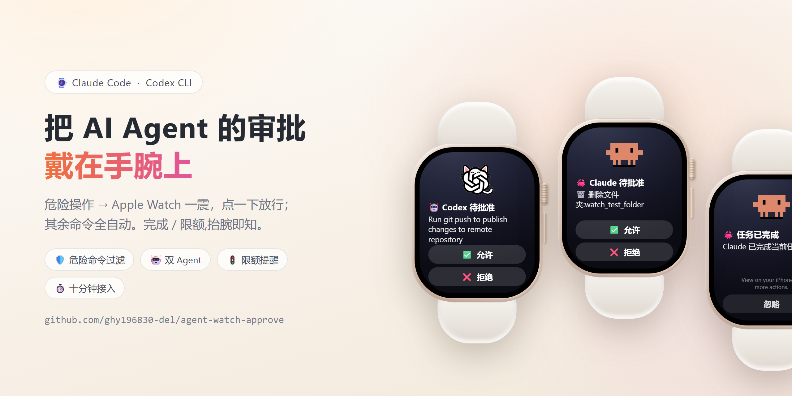
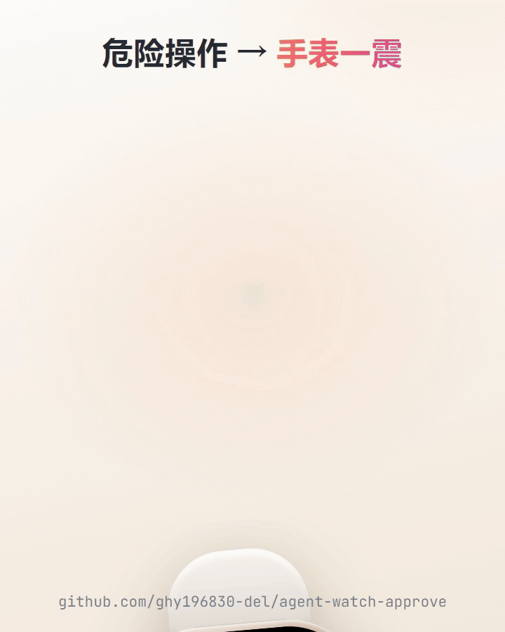
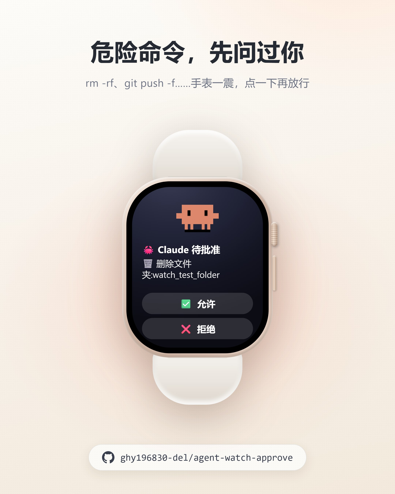
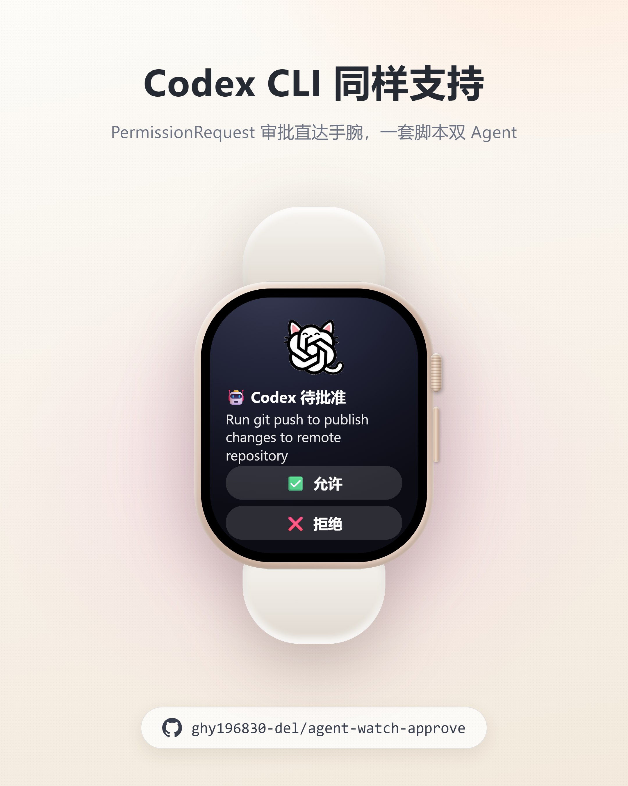
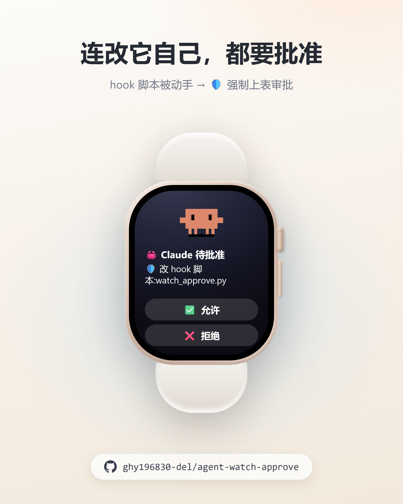
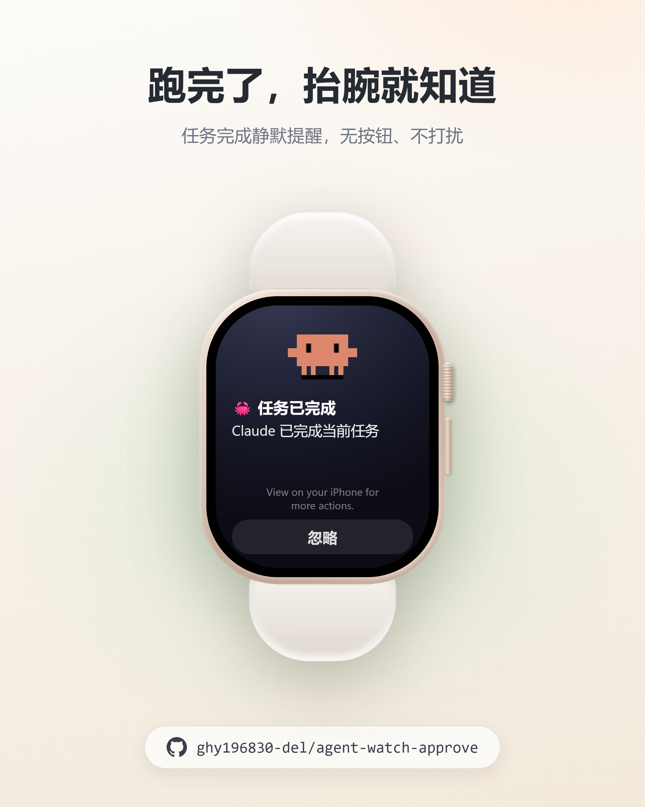
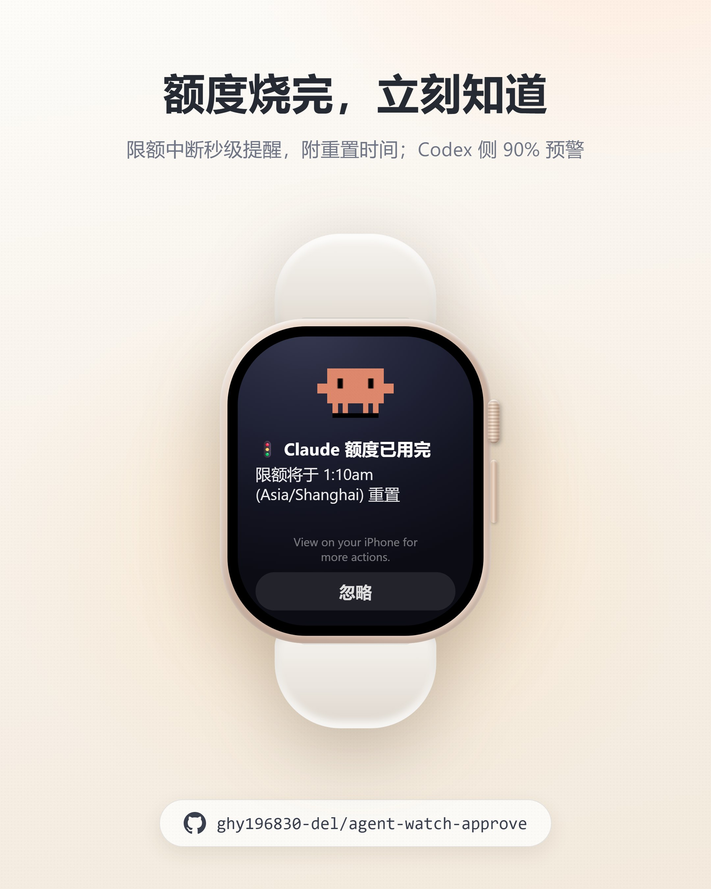
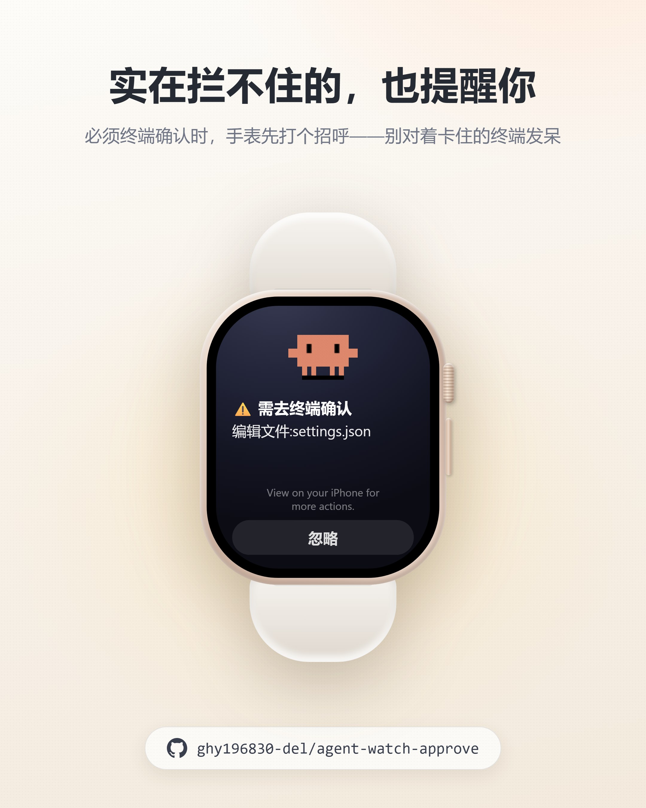
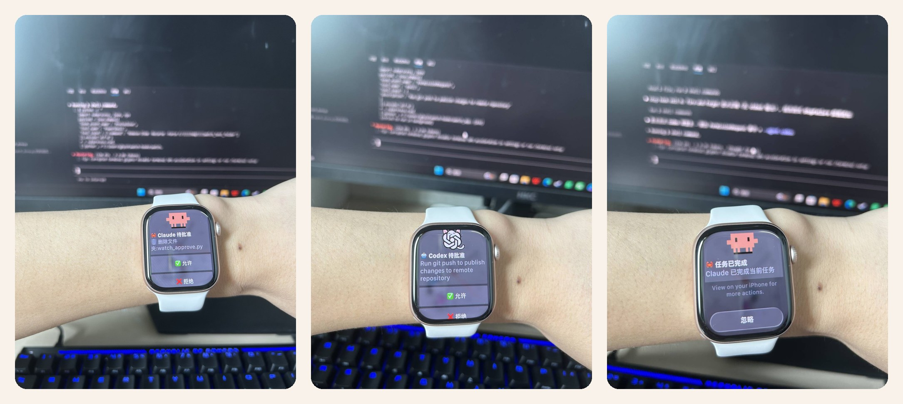
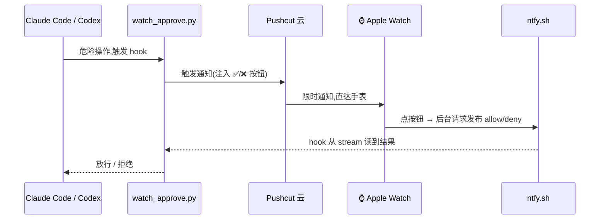

<div align="center">

# ⌚ agent-watch-approve

**AI 在干活,你在摸鱼;危险操作抬腕一点,任务跑完手表喊你。**

让 **Claude Code** 和 **Codex** 的危险操作推送到你的 **Apple Watch / iPhone** 上审批,
任务完成自动通知 —— 全程不用回终端。

[](https://github.com/ghy196830-del/agent-watch-approve/actions)
[](./LICENSE)


**[English](./README.en.md)**



| Claude Code 的通知 | Codex 的通知 |
|:---:|:---:|
|  |  |
| 🦀 Claude 待批准 / 🦀 任务已完成 | 🤖 Codex 待批准 / 🤖 任务已完成 |

</div>

## 📺 看它干活

<div align="center">
  
  <br>
  <sub>危险操作 → 手表一震 → ✅ 点一下放行,agent 继续干活</sub>
</div>

▶️ **[完整介绍视频(30 秒)](https://cdn.jsdelivr.net/gh/ghy196830-del/agent-watch-approve@c757785/assets/showcase/intro.mp4)** —— 点开即播(备用:[仓库内文件](./assets/showcase/intro.mp4))

<!-- 📺 抖音/B站视频发布后,把链接贴在这里 -->

### 功能速览

| | | |
|:---:|:---:|:---:|
| [](./assets/showcase/card-claude-approve.jpg) | [](./assets/showcase/card-codex-approve.jpg) | [](./assets/showcase/card-hook-protect.jpg) |
| 危险命令,先问过你 | Codex CLI 同样支持 | 连改它自己都要批准 |
| [](./assets/showcase/card-task-done.jpg) | [](./assets/showcase/card-rate-limit.jpg) | [](./assets/showcase/card-terminal-forced.jpg) |
| 跑完了,抬腕就知道 | 额度烧完,立刻知道 | 拦不住的,也提醒你 |

### 📸 真机实拍

<div align="center">
  
  <br>
  <sub>左:Claude 要删文件夹,手表上批 · 中:Codex 要 git push,同一块表照单全收 · 右:跑完了,抬腕就知道</sub>
</div>

---

## 它解决什么问题

跑长任务时,agent 时不时停下来问一句「可以执行吗?」——你必须守着终端。这个项目把这件事搬到手腕上:

1. **⌚ 远程审批** —— 危险操作(`rm -rf`、`git push --force`、提权、出沙箱……)推送到手表,带 **✅ 允许 / ❌ 拒绝** 按钮,点一下,结果秒回 agent;
2. **🔔 完成提醒** —— agent 每跑完一轮任务,手表震一下「任务已完成」,你随时回来验收;
3. **🚦 限额提醒** —— 订阅额度用完(Claude)或快烧完(Codex,默认 ≥90% 预警)时第一时间通知你,附重置时间;任务被 API 错误中断也会提醒;
4. **🤖 其余全自动** —— 不危险的操作静默放行(可配),终端再也不弹「yes/no」。
5. **🪟 多窗口并行** —— 同时开几个项目/窗口也不串台:每次审批走独立回执通道,点谁批谁;通知带「📁 项目名」,一眼分清是谁在问。

两个 Python 脚本,**只用标准库、零依赖**,并且**全程 fail-safe**:配置缺失 / 网络挂了 / 超时,一律退回 agent 自己的终端审批,绝不卡死你的任务。



## 前置条件

- **Claude Code** 和/或 **Codex CLI**
- **Python 3**(在 PATH 上;只用标准库,无需 `pip install`)
- **[Pushcut](https://www.pushcut.io/)** 账号(hook 动态注入按钮需要 **Pro**),iPhone **和 Apple Watch 都装上 app**
- 一个 **[ntfy](https://ntfy.sh/)** topic(公共 ntfy.sh 即可,**topic 名就是密码,取长随机串**)
- (国内)一个本地 HTTP 代理,如 Clash 的 `http://127.0.0.1:7890`

## 十分钟上手

### 第 0 步:准备 Pushcut 和 ntfy

1. Pushcut 里建一条 Notification(名字随意,填进配置的 `PUSHCUT_NOTIF`),标题/正文/按钮都不用配——hook 会动态覆盖;
2. **Account → API** 拿 API key;
3. 想一个长随机 ntfy topic 名,例如 `myagent_8f3k2j9x`(无需注册)。

### 第 1 步:放脚本

把 `watch_approve.py`、`watch_done.py`、`watch.env` 放进一个**固定目录**,例如 `C:\Users\你\watch-hooks\`(macOS/Linux 如 `~/watch-hooks/`):

```bash
git clone https://github.com/ghy196830-del/agent-watch-approve.git
cp agent-watch-approve/watch_approve.py agent-watch-approve/watch_done.py ~/watch-hooks/
cp agent-watch-approve/watch.env.example ~/watch-hooks/watch.env   # 然后填入你的 key/topic
```

> **为什么要 `watch.env`?** hook 子进程的环境变量取决于「谁启动了 agent」,Codex 还**不会**把
> 自己配置里的 env 传给 hook。脚本启动时会读同目录的 `watch.env` **兜底**(只填补缺失项,
> 真实环境变量优先),这样从 VS Code、终端、任何地方启动 agent 都能工作。

### 第 2 步:接 Claude Code

把 [`examples/claude/settings.example.json`](./examples/claude/settings.example.json) 合并进
`~/.claude/settings.json`(全局)或项目的 `.claude/settings.json`,改好脚本绝对路径。重启 Claude Code 生效。

关键就两块:`PreToolUse`(审批)+ `Stop`(完成提醒),matcher 用 `"*"` 配合 danger-only(见下文「自动驾驶」)。

### 第 3 步:接 Codex

把 [`examples/codex/hooks.example.json`](./examples/codex/hooks.example.json) 放到 `~/.codex/hooks.json`,改好脚本绝对路径。

**Codex 的三个专属注意点(都踩过坑了):**

1. **挂的是 `PermissionRequest` 事件,不是 `PreToolUse`。** Codex 只在自己要弹审批时(提权 / 出沙箱 / 联网等)触发它,hook 回 allow/deny;不回应就走正常终端审批。语义刚好和手表审批对齐。
   (Codex 的 `PreToolUse` 拦不到新版 shell 通道,且不支持 `ask`,别用它做审批。)
2. **hook 必须先「信任」才会跑,而且改一次就要重新信任** —— 否则被**静默跳过**,无任何报错。在 Codex TUI 里运行 **`/hooks`** → 找到这两条 hook → review & trust。
3. **`codex exec`(非交互模式)永远不会触发 `PermissionRequest`**(它的 approval policy 是 never)。测试审批请用交互式会话;`Stop` 完成提醒在 exec 下正常触发。

### 第 4 步:不经过 agent,先单测一发

```bash
# Claude 风格(PreToolUse):
echo '{"hook_event_name":"PreToolUse","tool_name":"Bash","tool_input":{"command":"rm -rf /tmp/x"}}' \
  | python ~/watch-hooks/watch_approve.py

# Codex 风格(PermissionRequest):
echo '{"hook_event_name":"PermissionRequest","tool_name":"Bash","tool_input":{"command":"git push --force"}}' \
  | python ~/watch-hooks/watch_approve.py --agent codex

# 完成提醒:
python ~/watch-hooks/watch_done.py < /dev/null
```

手表上点 **✅ 允许**,第一条会立刻输出 `permissionDecision: "allow"`,第二条输出
`decision: {"behavior": "allow"}`(Codex 格式,脚本按事件自动切换)。

> ⚠️ 开了 danger-only(默认推荐配置)后,要用**危险命令**测试——`echo hello` 按设计不弹通知。

## 自动驾驶模式(推荐配置)

`watch.env.example` 里的默认值就是这套「**危险才打扰,其余全自动**」:

```
WATCH_DANGER_ONLY=1            # 只有命中危险清单的操作才上手表
WATCH_NONDANGER_DECISION=allow # 其余静默放行(不弹手表、不弹终端)
```

配合 Claude Code 的 `"matcher": "*"`:**所有**工具调用都过 hook,非危险的(读文件、搜索、MCP……)
静默放行,只有真正危险的才震你手腕。为什么不用白名单 matcher?——白名单永远会漏掉下一个新工具
(`WebSearch`、新 MCP……),漏掉的会退回**终端**弹窗,你的手表永远收不到。

内置危险清单覆盖:`rm -rf`、`sudo`、`git push --force`、`git reset --hard`、`dd`、`mkfs`、
`chmod 777`、`shutdown`、`kill`、`DROP/TRUNCATE TABLE`、`DELETE FROM`、`curl | sh`、
`docker rm/prune`、`terraform destroy`、`kubectl delete`、PowerShell `Remove-Item -Recurse -Force` 等。
`WATCH_DANGER_EXTRA` 可追加,`WATCH_DANGER_REGEX` 可整体替换。

> ⚠️ 代价要心里有数:`allow` 模式下,危险清单**没逮到**的操作会无确认直接执行。
> 危险正则是唯一关卡,按自己的口味扩充它。

**手表上看到的不是命令原文**,而是一句人话 + 目标文件名,例如:

> 🗑️ 删除文件夹:node_modules
> ⚠️ git 强制推送:main
> 📝 修改文件:app.py、readme.md

**防 agent「自改 hook」**:设 `WATCH_PROTECT_PATHS=watch-hooks` 后,任何对脚本目录的**写操作**
也强制上手表(🛡️ 改 hook 脚本),agent 想偷偷解除你的管控?先过你手腕这关。

## 限额提醒(订阅党刚需)

Claude Code 和 Codex 的订阅都有用量窗口,烧完直接给你停活——人在摸鱼,任务在后台默默死掉是最惨的。
这件事也搬上手表了,两边机制不同(都实测过):

- **Claude**:挂在官方 **`StopFailure`** hook 上(回合因 API 错误终止时代替 Stop 触发)。
  限额错误(`error=rate_limit`)→「**🚦 Claude 额度已用完**」+ 重置时间(从错误文案里抽出
  `resets 1:10am (Asia/Shanghai)` 这类信息);其它 API 错误 →「**⚠️ 任务异常终止**」+ 错误类型。
- **Codex**:限额报错的回合**不跑任何 hook**(读源码确认:错误路径直接 break),没法在死亡瞬间通知,
  所以改为**预警**:每次任务完成时顺带读 Codex 自己的额度遥测(rollout 里的 `rate_limits`,含
  `used_percent` 和重置时间),用量 ≥ `WATCH_LIMIT_WARN_PCT`(默认 **90%**)时,完成通知自动变成
  「**⚠️ Codex 额度已用 NN%**」+ 重置时间——在烧干**之前**就提醒你省着点用。
- 这类通知用单独的警示音(`WATCH_LIMIT_SOUND`,默认 `problem`),和普通完成提醒一耳朵区分。

接线:Claude 在 settings.json 的 hooks 里加一段 `StopFailure`(示例已含);Codex 无需额外接线(复用已有的 Stop)。

## 多窗口并行

同时开几个 Claude Code / Codex 窗口?两件事已经内置:

- **互不串台** —— ntfy 是发布/订阅:若所有窗口共用一个 topic,你在 A 窗口的通知上点 ✅,正在等批的 B 窗口会收到同一条回执、被一起放行。所以每次审批都用**独立回执 topic**(基础 topic + 随机后缀),按钮只对自己那次请求生效;过期通知上的迟到点击也不会误批后来的请求。(实测:两窗口同时等批,两次点击各放各的,互不影响。)
- **分得清来源** —— 审批和完成通知的正文末尾都带「📁 项目文件夹名」,一眼看出是哪个窗口在说话。

不想要?`WATCH_UNIQUE_TOPIC=0` 回到共享 topic,`WATCH_SHOW_CWD=0` 去掉 📁 行。
注意:app 里手配静态按钮(`PUSHCUT_DYNAMIC_ACTIONS=0`)指向固定 topic,只能共享——多窗口请用默认的动态按钮。

## 双 agent 视觉区分

同一份脚本服务两个 agent,通知一眼可辨(`--agent codex` 或 `WATCH_AGENT=codex` 切换):

| | 标题 | 配图(透明背景矮横幅,走 jsDelivr CDN,国内可达) |
|---|---|---|
| **Claude Code** | 🦀 Claude 待批准 / 任务已完成 | 官方像素螃蟹 Clawd **动图**(手机上会眨眼挪腿) |
| **Codex** | 🤖 Codex 待批准 / 任务已完成 | GPT 结猫(仓库 `assets/gpt-cat.png`;另有官方结图标 `gpt-logo.png` 备选) |

想换图:`PUSHCUT_IMAGE=<你的图片URL>`(对两个 agent 统一生效),`none` 则不带图。

## 配置参考(环境变量 / watch.env)

**核心**

| 变量 | 默认 | 说明 |
|------|------|------|
| `PUSHCUT_KEY` | — | **必填。** Pushcut API key |
| `NTFY_TOPIC` | — | **必填。** 回传通道 topic(就是密码,取长随机) |
| `PUSHCUT_NOTIF` | `claude` | Pushcut 里那条通知的名字 |
| `HTTPS_PROXY` | — | 出网代理,如 `http://127.0.0.1:7890`(回退 `HTTP_PROXY`) |
| `WATCH_AGENT` | `claude` | `claude` / `codex`;命令行 `--agent` 优先级更高 |
| `WATCH_ENV_FILE` | 脚本旁的 `watch.env` | 兜底配置文件路径 |

**送达(Apple Watch 实测三件套)**

| 变量 | 默认 | 说明 |
|------|------|------|
| `PUSHCUT_DEVICES` | (全部设备) | **建议 `iPhone,watch`**:直接点名手表,绕过 iOS 镜像规则(设备名看 Pushcut `GET /v1/devices`) |
| `PUSHCUT_SOUND` | `default` | **不带声音手表不震!** `vibrateOnly`=只震不响,`none`=静默 |
| `PUSHCUT_TIME_SENSITIVE` | `1` | 限时通知:**iPhone 在用时也能上手表**,冲破专注/勿扰(实测唯一可靠手段) |

**审批行为**

| 变量 | 默认 | 说明 |
|------|------|------|
| `APPROVE_WAIT` | `240` | 等回执秒数(要小于 hook timeout 300) |
| `APPROVE_TIMEOUT_DECISION` | `ask` | 超时没人点:`ask`(退回终端)/`allow`/`deny` |
| `WATCH_DANGER_ONLY` | `0` | `1`=只有危险操作上手表 |
| `WATCH_NONDANGER_DECISION` | `ask` | danger-only 下非危险操作:`ask`/`allow`/`deny` |
| `WATCH_DANGER_EXTRA` | — | 追加危险正则(换行分隔) |
| `WATCH_DANGER_REGEX` | — | 整体替换内置危险清单 |
| `WATCH_PROTECT_PATHS` | — | 逗号分隔子串;写类工具碰到即强制上手表 |
| `WATCH_DESC_MAX` | `80` | 通知正文最大字符数(手表屏幕小) |
| `WATCH_UNIQUE_TOPIC` | `1` | 每次审批用独立回执 topic(基础 topic+随机后缀),多窗口并行不串台;`0`=共享 |
| `WATCH_SHOW_CWD` | `1` | 通知正文末尾带「📁 项目文件夹名」,多窗口分清来源;`0`=关 |

**外观与完成提醒**

| 变量 | 默认 | 说明 |
|------|------|------|
| `PUSHCUT_IMAGE` | 按 agent 取预设 | 通知配图 URL;`none`=不带 |
| `WATCH_DONE_TITLE` / `WATCH_DONE_TEXT` | 按 agent 取预设 | 完成提醒的标题/正文 |
| `WATCH_DONE_SOUND` | `jobDone` | 完成提醒声音 |
| `WATCH_LIMIT_WARN_PCT` | `90` | (Codex)额度预警阈值 %,任务完成时用量超过即预警;`0`=关闭 |
| `WATCH_LIMIT_SOUND` | `problem` | 限额/异常类通知的声音 |

**网络与调试**

| 变量 | 默认 | 说明 |
|------|------|------|
| `PUSHCUT_RETRIES` | 审批 `12` / 完成 `8` | 触发 Pushcut 的重试次数(应对代理 TLS 偶发失败) |
| `PUSHCUT_TIMEOUT` | 审批 `3` / 完成 `6` | 单次触发超时(秒);压短=失败快速重试,降低体感延迟 |
| `NTFY_BASE` | `https://ntfy.sh/` | 自建 ntfy 时改 |
| `PUSHCUT_DYNAMIC_ACTIONS` | `1` | `1`=hook 动态注入按钮(需 Pro);`0`=用 app 里手配按钮 |
| `WATCH_DEBUG_DUMP` | `0` | `1`=每次运行把 hook 原始输入写到 `%TEMP%/watch_*_last_input_<agent>.json` |

## Apple Watch 实战笔记(全是实测踩出来的)

- **限时通知(Time-Sensitive)是手表稳定收到的关键。** 普通通知只有 iPhone 锁屏时才镜像到手表;
  手机在用时 iOS 会把通知留在手机上。A/B 实测:两条只差这个字段的通知,只有限时那条上了手表。
  默认已开(`PUSHCUT_TIME_SENSITIVE=1`),同时建议 `PUSHCUT_DEVICES=iPhone,watch` 直接点名手表。
- **按钮必须是「后台 web 请求」**(本 hook 已是)。watchOS 不支持「打开 app / 跑快捷指令」类按钮。
- **必须带声音**(`PUSHCUT_SOUND=default`),否则手表不震。
- **某台设备突然收不到了 → 在它上面重开 Pushcut app。** app 被杀/长期后台会让推送 token 失效,
  此时 Pushcut API 照样返回「成功」但什么都到不了。重开即恢复(顺带让手表重新同步)。
- 手表上动图只显示静帧(watchOS 限制);iPhone 展开通知能看到螃蟹动起来。

## 排错

| 现象 | 原因 / 处理 |
|------|------|
| Pushcut 返回 404 | 云端没有 `PUSHCUT_NOTIF` 这个名字的通知(去 app 里建,确认已同步) |
| Pushcut 返回 401/403 | `PUSHCUT_KEY` 不对 |
| 发送成功但**所有设备**收不到 | 推送 token 失效 → **重开 iPhone 上的 Pushcut app**。「成功」只代表云端接收,不代表设备收到 |
| 手机收到、手表收不到 | 保持 `PUSHCUT_TIME_SENSITIVE=1` + `PUSHCUT_DEVICES` 点名手表;确认手表装了 Pushcut、iOS 允许其限时通知 |
| Claude 还是在终端弹确认 | 工具没被 matcher 覆盖 → 用 `"matcher": "*"` + danger-only + `allow`(见自动驾驶) |
| **Codex 的 hook 完全不触发** | ① 没信任/改后未重新信任 → Codex TUI 跑 `/hooks` review & trust(被跳过时**无任何报错**);② 你在用 `codex exec` 测审批 → 它永远不触发 `PermissionRequest`,换交互式;③ 排查传参:`WATCH_DEBUG_DUMP=1` 看 `%TEMP%` 留痕 |
| Codex 的 hook 拿不到 key/代理 | Codex 不把 env 传给 hook → 用脚本同目录的 **`watch.env`**(本仓库方案,已内置) |
| 表上点按钮提示 not supported | 按钮不是后台 web 请求(默认配置已是,别改成 open-url) |
| 不震动 | `PUSHCUT_SOUND=default`(或 `vibrateOnly`) |
| Windows 手动测试中文变 `???` | PowerShell 管道编码锅,不是 hook 的问题;真实运行不受影响。测试时用 UTF-8 文件或环境变量传值 |
| 多窗口同时等批,点一个全放行了 | 升级到带 `WATCH_UNIQUE_TOPIC` 的版本(默认开);静态按钮模式(`PUSHCUT_DYNAMIC_ACTIONS=0`)不支持隔离,多窗口请用动态按钮 |

任何失败路径都返回「退回正常审批」,agent 永远不会因此卡死。

## 安全

- 密钥只从环境变量 / `watch.env` 读取,不硬编码;`.gitignore` 已排除 `*.env`,别把真实配置提交上来。
- 公共 ntfy.sh 上 topic 名是回传通道唯一防线 → 取长随机串,或自建带鉴权的 ntfy(`NTFY_BASE`)。
- `WATCH_NONDANGER_DECISION=allow` 等于把非危险操作的放行权交给危险正则,启用前想清楚、按需扩充清单。
- 建议配 `WATCH_PROTECT_PATHS` 把 hook 脚本自身保护起来,防止 agent 改掉你的管控。

## License

MIT —— 见 [LICENSE](./LICENSE)。图标素材:Clawd 螃蟹来自 Claude Code 官方吉祥物;GPT 结猫为本仓库自制衍生图。
