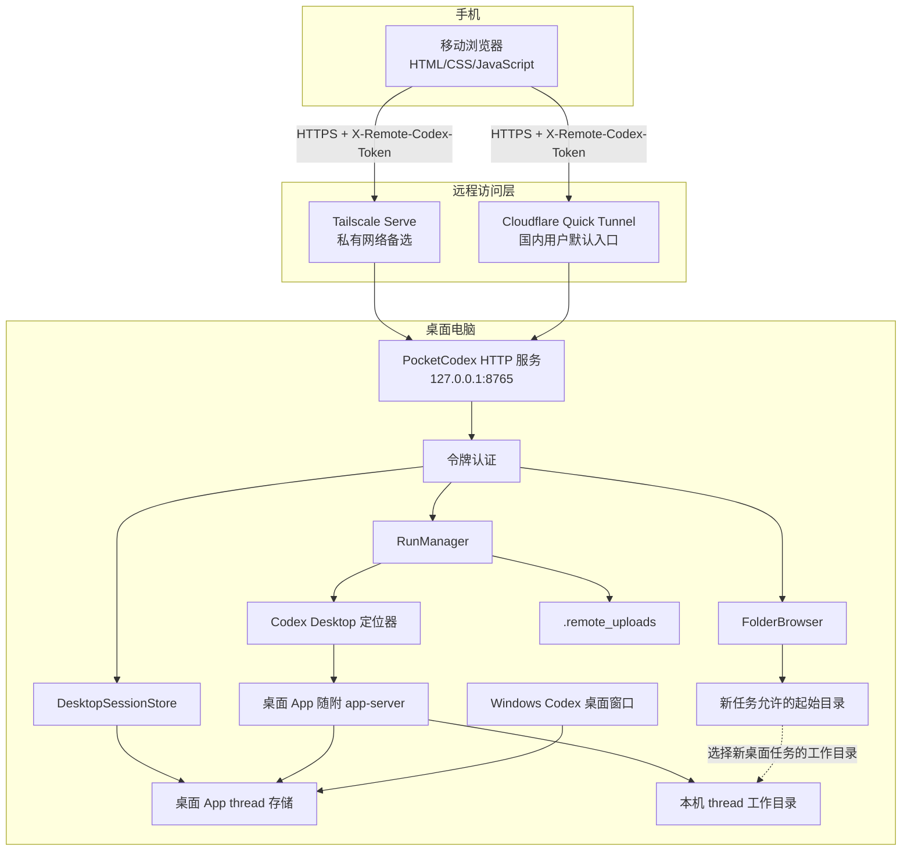
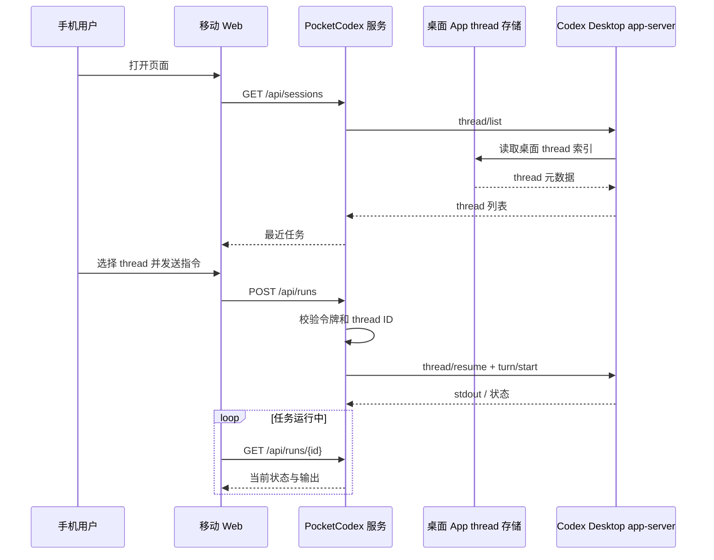
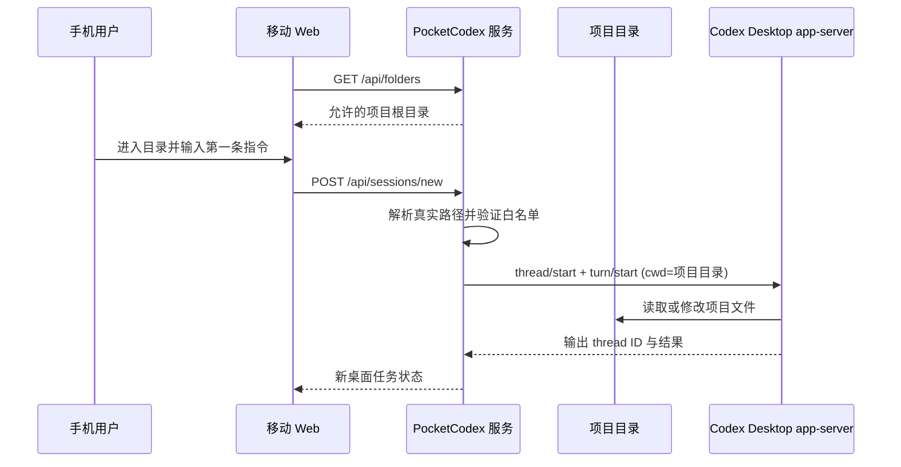
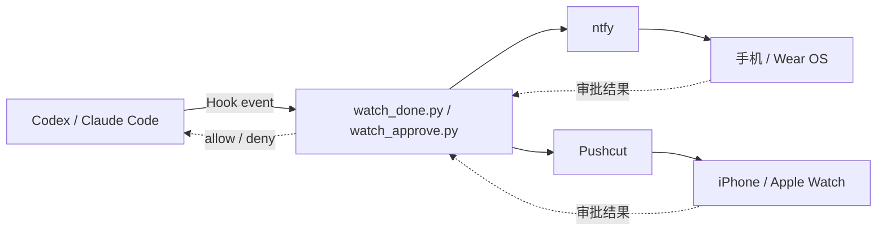

# PocketCodex 架构说明

本文描述 PocketCodex 当前实现的组件边界、数据流和安全模型。它反映的是仓库中的实际代码，而不是未来设想。

## 1. 系统边界

PocketCodex 是运行在用户桌面电脑上的轻量 HTTP 服务。手机浏览器通过安全隧道访问该服务，服务再连接 Windows Codex 桌面 App 随附的 `app-server`，读取、新建或继续同一份持久化 thread。

它不包含云端业务服务器，不把项目文件同步到 PocketCodex 自有云端，也不通过鼠标或窗口自动化控制 Codex。PocketCodex 与桌面窗口共享 thread 存储，但两者使用各自的 app-server 进程。

## 2. 组件职责

### 移动 Web 客户端

目录：`remote_web/`

- 调用 `/api/sessions` 展示桌面版最近任务。
- 调用 `/api/runs` 继续已有 thread。
- 调用 `/api/sessions/new` 在选定工作目录中新建桌面任务。
- 每 2.5 秒轮询当前 run，每 5 秒刷新任务列表。
- 在浏览器端压缩图片并随 JSON 请求上传。
- 从 URL fragment 读取首次访问令牌，保存到浏览器 `localStorage`，后续通过 `X-Remote-Codex-Token` 请求头发送。

### HTTP 服务与认证

文件：`remote_codex_server.py`

- 使用 Python 标准库 `ThreadingHTTPServer` 提供静态文件和 JSON API。
- 默认仅监听 `127.0.0.1:8765`。
- 首次启动生成至少 24 字符的随机访问令牌并写入 `remote.env`。
- 对 API 使用常量时间比较验证请求头、查询参数或 Cookie 中的令牌。
- 对静态响应和 API 响应设置 `no-store`，并禁止页面被嵌入 iframe。

### DesktopSessionStore

- 通过 app-server 的 `thread/list` 获取桌面版任务索引。
- 将 thread ID、工作目录、名称、预览和更新时间转换为移动端任务摘要。
- 默认返回桌面版最近 30 个 thread。

### FolderBrowser

- 维护允许新建桌面任务的项目根目录白名单。
- 默认根目录是当前用户的 `Desktop` 和 `Documents`。
- `REMOTE_CODEX_ROOTS` 可覆盖默认根目录。
- 拒绝不存在、不是目录或逃逸到白名单外的路径。
- 只列出非隐藏子目录，单层最多 250 个。

### DesktopAppLocator

- 优先读取 `REMOTE_CODEX_DESKTOP_EXE` 显式路径。
- 自动查找 `%LOCALAPPDATA%\OpenAI\Codex\bin\*\codex.exe` 中桌面 App 缓存的 app-server。
- 必要时通过 `Get-AppxPackage OpenAI.Codex` 获取 Microsoft Store 安装目录。
- 不会回退到 `PATH` 上的同名命令，确保始终使用桌面 App 随附的 app-server。

### AppServerClient 与 RunManager

- 启动 Codex 桌面 App 随附的 `codex.exe ... app-server --stdio`。
- 通过逐行 JSON 协议完成 `initialize` 握手。
- 新任务依次调用 `thread/start` 和 `turn/start`。
- 已有任务依次调用 `thread/resume` 和 `turn/start`。
- 监听 `item/agentMessage/delta`、`item/completed` 和 `turn/completed`，把桌面任务状态与最终回答返回移动端。
- 使用 `turn/interrupt` 停止任务，不会终止 Codex 桌面 App。
- 对未知或未支持的交互式 server request 返回错误，绝不自动批准敏感操作。
- 维护 queued、running、completed、failed、cancelled 等运行状态。

### 图片上传

- 浏览器先缩放和压缩图片。
- 服务端重新验证 Base64、图片签名、数量和大小。
- 每次最多 4 张，每张最大 8 MB，仅接受 JPEG、PNG、WebP。
- 文件临时保存在 `.remote_uploads/`，并作为 app-server 的 `localImage` 输入传入桌面任务。
- run 正常结束、失败或取消后的 `finally` 阶段会删除图片；服务进程异常退出时可能遗留文件。

## 3. 关键请求流程

### 继续已有桌面任务

### 新建桌面任务

## 4. 网络模型

### Cloudflare Quick Tunnel

面向国内用户的默认上手路径：

- cloudflared 从本机主动建立到 Cloudflare 的出站连接。
- 手机不需要安装 Tailscale，但必须能够访问生成的 `trycloudflare.com` 地址。
- 部分国内 iPhone 用户会通过已经安装的小火箭（Shadowrocket）等代理工具访问；这些网络工具不属于 PocketCodex。
- 随机 URL 可从公网访问，PocketCodex 令牌成为主要应用层防线。
- URL 重启后通常改变，不适合作为固定服务地址。
- 当前方案没有 Cloudflare Access 身份策略，不应视为私有网络。

### Tailscale Serve

无法或不便使用 Tailscale 的用户不需要安装它。已经具备 Tailscale 条件、并希望获得固定私有入口时，可以选择该方案：

- PocketCodex 仍只监听 loopback。
- Tailscale 在 tailnet 内提供 HTTPS 入口。
- tailnet 身份和 ACL 构成令牌以外的第二层访问控制。
- 手机和电脑都需要加入同一 tailnet。

## 5. 安全边界

### 已有控制

- 默认仅监听 `127.0.0.1`。
- API 需要随机令牌，比较使用 `hmac.compare_digest`。
- thread 只能从桌面 App 返回的任务索引中选择，不能提交任意 thread ID。
- 新桌面任务的工作目录受根目录白名单约束。
- 图片数量、大小、格式和整体请求大小受限。
- 响应禁止缓存，并设置基础浏览器安全头。

### 不在保证范围内

- 令牌不是多用户账户系统，没有权限角色、过期时间或设备撤销列表。
- 拿到有效令牌的调用方可以向桌面版 Codex thread 发送任意自然语言指令。
- 根目录白名单只约束新任务的起始目录，不约束已有 thread，也不是 Codex 的文件系统沙箱。
- Codex 最终可执行的文件和命令范围仍由桌面 App app-server 的 sandbox、approval policy 和本机权限决定。
- PocketCodex 的 app-server 与已打开桌面窗口的 app-server 是两个进程。未支持的审批不会自动转移到桌面窗口，PocketCodex 也不会自动批准。
- Quick Tunnel 随机 URL 不是访问控制。
- 上传图片在 run 收尾阶段自动清理，但服务异常终止可能遗留文件；运行输出仅保存在进程内存中。
- 进程内 run 状态在服务重启后不会恢复。
- 停止进程不会回滚 Codex 已经完成的文件修改。
- 两个 app-server 不共享实时内存事件，不应同时向同一 thread 发送 turn。
- `app-server` 属于 Codex 桌面 App 内部接口，桌面版升级可能引入协议兼容变化。

### 部署原则

1. 保持服务绑定 loopback。
2. 使用默认 Quick Tunnel 时，把令牌和完整 URL 当作密码；不用时停止隧道。
3. 把 `remote.env` 当作密码文件处理。
4. 只开放必要项目根目录。
5. 令牌疑似泄漏时立即轮换。
6. 能够使用 Tailscale 时，可通过最小范围 ACL 获得额外隔离。
7. 不在不受信任或多人共用电脑上长期运行。

## 6. 可选通知链路

通知与审批脚本是旁路组件，不参与核心 API 请求：

核心远程控制不要求安装或配置这套链路。`watch_done.py` 可用于完成提醒；`watch_approve.py` 面向交互式桌面 Codex/Claude Code，不应被描述为 PocketCodex 非交互任务的审批安全边界。详情见 [NOTIFICATIONS.md](./NOTIFICATIONS.md)。

## 7. 后续架构方向

- 将启动、隧道和配置检查收敛为统一的 Windows 配置向导。
- 用可撤销、可过期的设备凭证替代单一长期令牌。
- 增加持久化 run 记录和上传文件清理策略。
- 增加结构化日志、健康状态和诊断导出。
- 为反向代理部署补充明确的可信代理和安全头策略。
- 保持核心服务与通知/审批插件解耦。
